# dotfiles

[](https://github.com/kachick/dotfiles/actions/workflows/ci-home.yml?query=branch%3Amain+)
[](https://github.com/kachick/dotfiles/actions/workflows/windows.yml?query=branch%3Amain+)
[](https://github.com/kachick/dotfiles/actions/workflows/ci-nix.yml?query=branch%3Amain+)
[](https://github.com/kachick/dotfiles/actions/workflows/ci-go.yml?query=branch%3Amain+)
[](https://github.com/kachick/dotfiles/actions/workflows/container.yml?query=branch%3Amain+)

Personal dotfiles that can be placed in the public repository\
Also known as [盆栽(bonsai)](https://en.wikipedia.org/wiki/Bonsai) 🌳

```mermaid
block-beta
    columns 3

    block:os:3
        nixos(("❄")) macos(("🍎")) windows(("🪟"))
    end

    block:vm:3
        lima("Lima") wsl2("WSL2")
    end

    block:container:3
        podman("🦭") k8s("☸️") 
    end

    nixos --> lima
    macos --> lima
    windows --> wsl2

    vm --> container
    nixos --> container
```



## For visitors

If you are using [Podman](https://podman.io/), you can test the pre-built [ubuntu container-image](containers) as follows.

```bash
bash <(curl -fsSL https://raw.githubusercontent.com/kachick/dotfiles/main/containers/sandbox-with-ghcr.bash) latest
```

Or, you can directly use some commands with `nix run` without any installation steps.

```bash
nix run 'github:kachick/dotfiles#todo'
```

List them

```bash
nix flake show 'github:kachick/dotfiles' --json 2>/dev/null | jq '.packages | ."x86_64-linux" | to_entries | map("\(.key) # \(.value.description)")'
```

## NixOS

List defined hostnames

```bash
nix eval --json 'github:kachick/dotfiles#nixosConfigurations' --apply 'builtins.attrNames' | jq '.[]'
```

Using flake style is disabled in NixOS by default and [you should inject git command to use flakes](https://www.reddit.com/r/NixOS/comments/18jyd0r/cleanest_way_to_run_git_commands_on_fresh_nixos/).

**NOTICE: This command might drop all existing users except which defined in configurations.**

```bash
nix --extra-experimental-features 'nix-command flakes' shell 'github:NixOS/nixpkgs/nixos-25.11#gitMinimal' \
  --command sudo nixos-rebuild switch \
  --flake "github:kachick/dotfiles#$(hostname)" \
  --show-trace
```

If you are experimenting to setup NixOS just after installing from their installer and want to avoid impure mode,\
See [generic configuration](nixos/hosts/generic) for my current workaround.

Finally, reboot the device

```bash
sudo reboot now
```

## home-manager

List definitions

```bash
nix eval --json 'github:kachick/dotfiles#homeConfigurations' --apply 'builtins.attrNames' | jq '.[]'
```

## Ubuntu

1. Install [Nix](https://nixos.org/download/) and enable [Flakes](https://wiki.nixos.org/wiki/Flakes)

   ```bash
   extra_conf_path="$(mktemp --suffix=.extra.nix.conf)"
   echo 'experimental-features = nix-command flakes' >> "$extra_conf_path"
   echo "trusted-users = root $USER @wheel" >> "$extra_conf_path"

   sh <(curl --proto '=https' --tlsv1.2 -L https://nixos.org/nix/install) --daemon --nix-extra-conf-file "$extra_conf_path"
   ```

1. If you forgot something adding in the installation phase, manually add it.\
   Some config needs rebooting to apply it such as `trusted-users`.

   ```bash
   echo 'experimental-features = nix-command flakes' | sudo tee --append /etc/nix/nix.conf
   ```

1. Make sure there is a nix directory that is used in the home-manager.\
   This is a workaround, See [the thread](https://www.reddit.com/r/Nix/comments/1443k3o/comment/jr9ht5g/?utm_source=reddit&utm_medium=web2x&context=3) for detail

   ```bash
   mkdir -p ~/.local/state/nix/profiles
   ```

1. Restart current shell to load Nix as a PATH

   ```bash
   bash
   ```

1. Apply dotfiles

   ```bash
   nix run 'github:kachick/dotfiles#home-manager' -- switch -b backup --flake 'github:kachick/dotfiles#wsl-ubuntu'
   ```

1. Apply system level dotfiles with [sudo for nix command](https://github.com/kachick/dotfiles/commit/2e47c6655dc74a4a56495fdcbebb9d15b0b57313)

   ```bash
   sudoc nix run 'github:kachick/dotfiles#apply-system'
   ```

1. Enable tailscale ssh if required

   ```bash
   sudoc tailscale up --ssh
   ```

### Podman on Ubuntu

1. Install uidmap without Nix for use of podman even if the podman will be installed from nixpkgs

   - "shadow" in nixpkg is not enough for podman - <https://github.com/NixOS/nixpkgs/issues/138423>

   ```bash
   sudo apt-get install --assume-yes uidmap
   ```

1. Make sure the cgroup v1 is disabled if you on WSL, See [the docs](windows/WSL/README.md)

1. Make sure you can run containers as `podman run public.ecr.aws/debian/debian:12.6-slim cat /etc/os-release`

## Debian

After installing missing tools, you can complete same steps as Ubuntu

```bash
sudo apt update
sudo apt upgrade
sudo apt install --assume-yes curl
sudo apt install --assume-yes dbus-user-session # For podman
```

Remember to set special config and reboot if you on WSL

```bash
echo '
[boot]
systemd=true' | sudo tee /etc/wsl.conf
```

## Windows

1. Install [WSL2](windows/WSL/README.md) with default Ubuntu. Activate home-manager as `kachick@wsl-ubuntu`
1. Install [NixOS-WSL](https://github.com/nix-community/NixOS-WSL). Activate home-manager with `$(whoami)@wsl-nixos`
1. Adjust Windows experience as written in [extracted steps](windows/README.md) and as written in [CI](.github/workflows/windows.yml) for further detail.

## Multi-booting on Windows and Linux

Check [traps](./windows/Multi-booting.md)

## macOS

I basically [give up](https://github.com/kachick/dotfiles/issues/911) to maintain my old Intel Mac.\
However I should keep the minimum environment for now.

1. Make sure installing official Nix. Determinate Nix dropped [x86_64-darwin](https://github.com/DeterminateSystems/nix-src/issues/224). It is earlier than [nixpkgs](https://github.com/NixOS/nixpkgs/pull/415566#issuecomment-3407311069).
1. Apply home-manager with `kachick@macbook` for minimum packages.
1. Install [some packages](https://github.com/kachick/dotfiles/wiki/macOS) without Nix
1. Use [Lima](#lima) for development tasks.

## Lima

1. Setup [Lima](https://github.com/lima-vm/lima) with default Ubuntu guest
1. In the lima as `limactl start`, apply home-manager with `kachick@lima`
1. You can run containers as `lima nerdctl run --rm hello-world`. You can also use podman after above `Podman on Ubuntu` setups

## How to setup secrets

Extracted to [wiki](https://github.com/kachick/dotfiles/wiki/Encryption)

## Shorthand

If you are developing this repository, putting `.env` makes easy reactivations.

```bash
echo 'HM_HOST_SLUG=wsl-ubuntu' > .env
```

Then you can enable configurations with

```bash
task apply
```
