# dotfiles

[](https://github.com/kachick/dotfiles/actions/workflows/ci-home.yml?query=branch%3Amain+)
[](https://github.com/kachick/dotfiles/actions/workflows/windows.yml?query=branch%3Amain+)
[](https://github.com/kachick/dotfiles/actions/workflows/ci-nix.yml?query=branch%3Amain+)
[](https://github.com/kachick/dotfiles/actions/workflows/ci-go.yml?query=branch%3Amain+)
[](https://github.com/kachick/dotfiles/actions/workflows/container.yml?query=branch%3Amain+)

Personal dotfiles that can be placed in the public repository\
Also known as [盆栽(bonsai)](https://en.wikipedia.org/wiki/Bonsai) 🌳

```mermaid
block-beta
    columns 3

    block:os:3
        nixos(("â„")) macos(("ðŸŽ")) windows(("🪟"))
    end

    block:vm:3
        lima("Lima") quickemu("Quickemu") wsl2("WSL2")
    end

    block:container:3
        podman("🦭") k8s("☸ï¸") 
    end

    nixos --> lima
    nixos --> quickemu
    macos --> lima
    windows --> wsl2

    vm --> container
    nixos --> container
```



## Visitors

You can test this some commands with Nix or similar container image

```bash
nix run 'github:kachick/dotfiles#todo'
```

List exposed commands

```bash
nix flake show 'github:kachick/dotfiles' --json 2>/dev/null | jq '.packages | ."x86_64-linux" | to_entries | map("\(.key) # \(.value.description)")'
```

## Lima

1. Setup [Lima](https://github.com/lima-vm/lima) with default Ubuntu guest
1. In the lima as `limactl start`, apply home-manager with `kachick@lima`
1. You can run containers with both ways
   - `lima nerdctl run --rm hello-world`.
   - [Podman on Ubuntu](docs/installations/generic-linux.md)

## Shorthand

If you are developing this repository, putting `.env` makes easy reactivations.

```bash
echo 'HM_HOST_SLUG=wsl-ubuntu' > .env
```

Then you can enable configurations with

```bash
task apply
```
