```mermaid
block-beta
    columns 3

    block:os:3
        nixos(("❄")) macos(("🍎")) windows(("🪟"))
    end

    block:vm:3
        lima("Lima") wsl2("WSL2")
    end

    block:container:3
        podman("🦭") k8s("☸️") 
    end

    nixos --> lima
    macos --> lima
    windows --> wsl2

    vm --> container
    nixos --> container
```

# dotfiles

[](https://github.com/kachick/dotfiles/actions/workflows/ci-home.yml?query=branch%3Amain+) [](https://github.com/kachick/dotfiles/actions/workflows/windows.yml?query=branch%3Amain+) [](https://github.com/kachick/dotfiles/actions/workflows/ci-nix.yml?query=branch%3Amain+) [](https://github.com/kachick/dotfiles/actions/workflows/ci-go.yml?query=branch%3Amain+) [](https://github.com/kachick/dotfiles/actions/workflows/container.yml?query=branch%3Amain+)

My personal dotfiles, safe to be shared publicly.
This repository is also my "Bonsai" 🌳, a project I carefully cultivate over time.



## Quick Start

If you are using [Podman](https://podman.io/), you can test the pre-built [Ubuntu container image](containers) as follows:

```bash
bash <(curl -fsSL https://raw.githubusercontent.com/kachick/dotfiles/main/containers/sandbox-with-ghcr.bash) latest
```

Alternatively, you can run commands directly with `nix run` without any installation.

```bash
nix run 'github:kachick/dotfiles#todo'
```

To list available commands:

```bash
nix flake show 'github:kachick/dotfiles' --json 2>/dev/null | jq '.packages | ."x86_64-linux" | to_entries | map("\(.key) # \(.value.description)")'
```

## NixOS

To list the defined hostnames:

```bash
nix eval --json 'github:kachick/dotfiles#nixosConfigurations' --apply 'builtins.attrNames' | jq '.[]'
```

Flakes are disabled by default in NixOS. [You need to use Git to enable them](https://www.reddit.com/r/NixOS/comments/18jyd0r/cleanest_way_to_run_git_commands_on_fresh_nixos/).

**NOTICE: This command might remove all users not defined in the configuration.**

```bash
nix --extra-experimental-features 'nix-command flakes' shell 'github:NixOS/nixpkgs/nixos-25.05#git' \
  --command sudo nixos-rebuild switch \
  --flake "github:kachick/dotfiles#$(hostname)" \
  --show-trace
```

If you are setting up NixOS from the installer and want to avoid impure mode, see the [generic configuration](nixos/hosts/generic) for my current workaround.

Finally, reboot your device.

```bash
sudo reboot now
```

## home-manager

To list the available definitions:

```bash
nix eval --json 'github:kachick/dotfiles#homeConfigurations' --apply 'builtins.attrNames' | jq '.[]'
```

## Ubuntu

1. Install the [Nix](https://nixos.org/) package manager using the [DeterminateSystems/nix-installer](https://github.com/DeterminateSystems/nix-installer) to enable [Flakes](https://nixos.wiki/wiki/Flakes) by default.

   ```bash
   curl --proto '=https' --tlsv1.2 -sSf -L https://install.determinate.systems/nix | sh -s -- install
   ```

2. Make sure your user or one of your groups is listed in `trusted-users`.

   ```console
   > grep trusted-users /etc/nix/nix.conf
   trusted-users = root your_user @your_user_group
   ```

3. Ensure the `nix` directory used by home-manager exists. This is a workaround; see [the thread](https://www.reddit.com/r/Nix/comments/1443k3o/comment/jr9ht5g/?utm_source=reddit&utm_medium=web2x&context=3) for details.

   ```bash
   mkdir -p ~/.local/state/nix/profiles
   ```

4. Restart your shell to apply the new `PATH`.

   ```bash
   ```

bash

````
5.  Apply the dotfiles:

    ```bash
nix run 'github:kachick/dotfiles#home-manager' -- switch -b backup --flake 'github:kachick/dotfiles#wsl-ubuntu'
````

6. Apply system-level configurations using [sudo for the nix command](https://github.com/kachick/dotfiles/commit/2e47c6655dc74a4a56495fdcbebb9d15b0b57313).

   ```bash
   ```

sudoc nix run 'github:kachick/dotfiles#apply-system'

````
7. If required, enable Tailscale SSH:

   ```bash
````

sudoc tailscale up --ssh

````
### Podman on Ubuntu

1. Install `uidmap` outside of Nix to use with Podman, even if Podman itself is installed via Nixpkgs.

   - "shadow" in nixpkgs is not sufficient for Podman: <https://github.com/NixOS/nixpkgs/issues/138423>

   ```bash
   sudo apt-get install --assume-yes uidmap
````

2. If you are on WSL, make sure cgroup v1 is disabled. See [the docs](windows/WSL/README.md) for more information.

3. Verify that you can run containers: `podman run public.ecr.aws/debian/debian:12.6-slim cat /etc/os-release`

## Debian

After installing the necessary tools, follow the same steps as for Ubuntu.

```bash
sudo apt update
sudo apt upgrade
sudo apt install --assume-yes curl
sudo apt install --assume-yes dbus-user-session # For Podman
```

If you are on WSL, remember to set the special configuration and reboot.

```bash
echo '\n[boot]\nsystemd=true' | sudo tee /etc/wsl.conf
```

## Windows

1. Install [WSL2](windows/WSL/README.md) with the default Ubuntu. Activate home-manager as `kachick@wsl-ubuntu`.
2. Install [NixOS-WSL](https://github.com/nix-community/NixOS-WSL). Activate home-manager with `$(whoami)@wsl-nixos`.
3. Adjust the Windows experience by following the [extracted steps](windows/README.md). For more details, refer to the [CI configuration](.github/workflows/windows.yml).

## Multi-booting on Windows and Linux

See the [potential issues and solutions](./windows/Multi-booting.md).

## macOS

I have mostly given up on maintaining the macOS environment.

1. Apply the home-manager configuration with `kachick@macbook` for a minimal set of packages.
2. Install [some packages](https://github.com/kachick/dotfiles/wiki/macOS) manually (without Nix).
3. Use [Lima](#lima) for development tasks.

## Lima

1. Set up [Lima](https://github.com/lima-vm/lima) with the default Ubuntu guest.
2. Inside the Lima VM (started with `limactl start`), apply the home-manager configuration with `kachick@lima`.
3. You can run containers using `lima nerdctl run --rm hello-world`. Podman can also be used after following the "Podman on Ubuntu" setup instructions above.

## How to set up secrets

See the [wiki](https://github.com/kachick/dotfiles/wiki/Encryption) for details.

## Shorthand

If you are developing this repository, you can create an `.env` file for easier reactivation of your environment.

```bash
echo 'HM_HOST_SLUG=wsl-ubuntu' > .env
```

Then, you can apply the configuration with:

```bash
task apply
```
